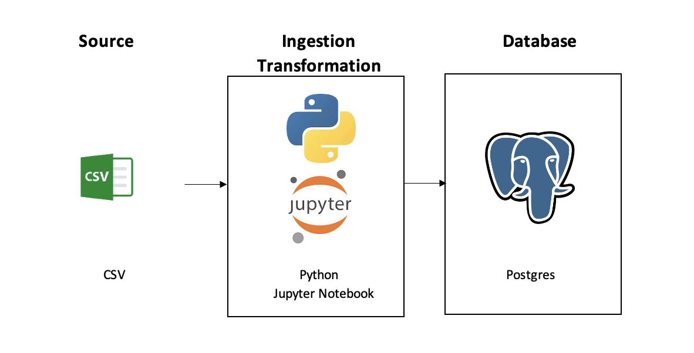

# 🐶 Dog Adoption Project

## Objective

Learn PostgreSQL, Docker and Python Modules about database.

## Technologies
- Database: PostgreSQL
- Language: Python(sqlalchemy, psycopg2)
- CI/CD: Docker
## Data Architecture

1. Data is extracted from [Kaggle](https://www.kaggle.com/datasets/whenamancodes/dog-adoption) and saved locally.
2. Tables are created with the appropriate columns and data types. 
3. Data is fed into the newly created tables.
